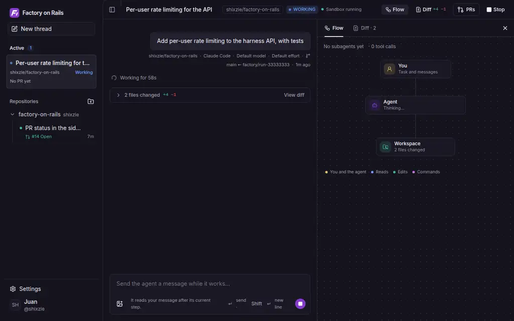

# Factory on Rails

A software factory hosted entirely on [Railway](https://railway.com). Sign in with
GitHub, pick or create a repository, describe a change, and a coding agent does
the work in a disposable Railway sandbox and opens a pull request. Written in
TypeScript with [Effect](https://effect.website).



While a run works you can follow it live, answer the agent's questions, and
watch its subagents and the flow of work between them on the Flow map.

The sidebar keeps active threads at the top, with unanswered questions first
and each thread's pull request status visible. Once every linked PR has merged
and no work or question remains, the thread moves into its repository's
collapsed **Settled** list. Sending a follow-up brings it back to **Active**.
To settle a finished thread yourself, hover or focus its sidebar row and click
the **Settle thread** archive button. This also works for threads without a PR;
threads still working or waiting for an answer must finish first.
Hover or focus a repository to use **+** and start a new thread in that repo.

Our own instance runs at [factory.shixzie.com](https://factory.shixzie.com), and
its Railway infrastructure is public: you can look around the project behind it
at
[railway.com/project/f4356592-cac1-4edf-a3bd-b58d0a8c023a](https://railway.com/project/f4356592-cac1-4edf-a3bd-b58d0a8c023a).

```
.railway/railway.ts     Railway infrastructure as code (services, database)
apps/web                Web UI (Next.js + shadcn/ui): runs as threads, composer, settings
apps/harness            API and auth backend: GitHub login, repos, runs, keys (JSON)
apps/runner             Worker: runs each task in a Railway sandbox, opens the PR
packages/core           Schema, data access, GitHub App auth, encryption
docs/architecture.md    How it fits together and what comes next
docs/setup.md           Setup by hand: GitHub App, tokens, shared variables, IaC
docs/railway-template.md  How the one-click Railway template is put together
```

```bash
pnpm install
pnpm run typecheck
pnpm test
```

See [docs/architecture.md](docs/architecture.md) for the design.

Configure MCP servers under **Settings → MCP servers** to give Claude Code and
Codex access to your tools across threads. Add a remote HTTP endpoint with a
bearer token, custom headers, or OAuth sign-in, or configure a command that runs
inside the sandbox. Servers and encrypted credentials belong to your account;
enabled servers are loaded for each new thread and the next turn of existing
threads. See [MCP setup](docs/setup.md#mcp-servers) for authentication and examples.

## Host your own

<!-- Deploy button: replace TEMPLATE_CODE with the template's code (docs/railway-template.md, step 4), then uncomment.
[](https://railway.com/new/template/TEMPLATE_CODE?utm_medium=integration&utm_source=button&utm_campaign=factory-on-rails)
-->

Factory on Rails runs entirely on [Railway](https://railway.com). The Railway
template deploys the web UI, the API, the runner and Postgres, already wired
together with a generated encryption key. What's left is what only you can
do, and the app walks you through it on its setup page:

1. **Deploy the template.** Railway asks for one value, `ALLOWED_GITHUB_LOGINS`:
   your GitHub username (comma-separate several). Only those accounts can sign
   in, and the GitHub App has to belong to one of them.
2. **Open the web service's URL** once it's deployed (Railway shows it on the
   `web` service). It takes you to `/setup`.
3. **Create the GitHub App.** Click **Create GitHub App**, check what GitHub
   shows you, and confirm. The App's callback URL and permissions are filled
   in, and its credentials go straight into the factory's database, encrypted.
   To own it with an organization, type the organization's name and add it to
   `ALLOWED_GITHUB_LOGINS` first.
4. **Install the App** on the repositories the factory should work on
   (**Install on GitHub** on the setup page), then **sign in** with GitHub.
5. **Connect Railway sandboxes.** Create an account or workspace token at
   [railway.com/account/tokens](https://railway.com/account/tokens) and paste
   it. The factory uses it once to create an empty `agents` environment in the
   project and a token that can only reach that environment, then forgets it;
   you can delete the token afterwards.
6. **Save your agent credential** under **Settings** (a Claude subscription
   token or Anthropic API key for Claude Code, a ChatGPT device login or an
   OpenAI API key for Codex)
   and start a run.

Costs: services and sandboxes are billed to the Railway workspace you deploy
into; each user's model usage goes to their own key or subscription. To open sign-in to
any GitHub account, set `ALLOWED_GITHUB_LOGINS` to `*` on the `harness` service
after setup.

For a custom domain, add it to the `web` service in Railway, then set
`PUBLIC_URL` on `harness` and `HARNESS_URL` on `runner` to `https://<your domain>`,
and add `https://<your domain>/auth/callback` to the GitHub App's callback URLs.

To run it without the template, with every credential in environment
variables and the infrastructure in `.railway/railway.ts` applied by CI (how
the maintainers' own deployment runs), follow [docs/setup.md](docs/setup.md).
How the template itself is built is in
[docs/railway-template.md](docs/railway-template.md).

Runner deployments preserve running sandboxes and reconnect to their commands
automatically. Apply migration `011_run_recovery.sql` before deploying the new
runner (the harness runs migrations before it deploys). A forced runner exit is
recovered once its heartbeat exceeds `STALE_RUN_SECONDS` (180 seconds by default).
The first upgrade cannot preserve commands started by an older runner, whose
shutdown still stops them; protection applies to runs started with this version.
Recovery requires Railway to retain the sandbox and its command sessions;
explicit cancellation still stops the work. See the
[run lifecycle](docs/architecture.md#the-harness-and-the-run-lifecycle).

### Image attachments

Paste or drop PNG, JPEG, WebP, or GIF images into either composer, or use its attachment button. A task or follow-up can include up to four images, each at most 5 MiB, with or without text. Images stay in the conversation and are delivered to the agent as files in its sandbox. Only the run's owner can view them, and they are deleted with the run.

Apply migration `013_run_images.sql` before deploying the updated harness and runner; the harness runs migrations before it deploys.

### Run model and reasoning effort

The new-run composer lets you choose a model and reasoning/thinking effort beside the agent picker. Choose a preset or enter a custom model ID. Default model and Default effort leave the agent’s own configuration in control. Choices are saved with the run, displayed in its details, reused for follow-up turns and PR descriptions, and prefilled for your next run. Switching agents resets both choices.

Availability depends on your account, installed CLI, and selected model; a preset does not grant access. Higher effort can increase latency and token usage. Claude Code receives `--model` and `--effort`; Codex receives `--model` and `-c model_reasoning_effort=…`. See the [Claude Code model configuration](https://code.claude.com/docs/en/model-config) and [Codex configuration reference](https://developers.openai.com/codex/config-reference).

Custom `AGENT_COMMAND`, `CODEX_COMMAND`, and describe-command overrides must consume `FACTORY_MODEL` and `FACTORY_REASONING_EFFORT` (empty means default). `FACTORY_CODEX_EFFORT` contains the complete quoted TOML assignment for a Codex `-c` argument, or an empty string. Always quote these values when using them as shell arguments. Apply migration `009_run_model_effort.sql` before deploying the updated harness and runner.
