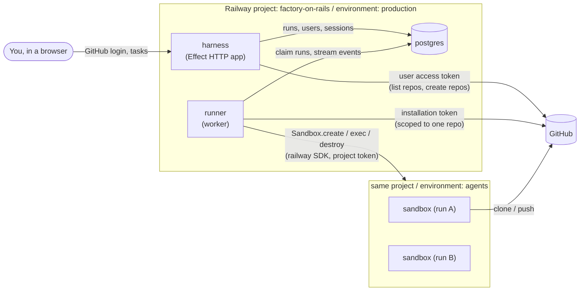

# Factory on Rails: architecture

Factory on Rails is a software factory that runs entirely on Railway. You sign in
with GitHub, pick a repository (or create one), describe a change, and a coding
agent does the work in a disposable Railway sandbox and hands it back as a pull
request. This document describes the first foundation: what exists in this
repository, how the pieces fit, and what comes next.

## Components



| Piece | Where | What it does |
|---|---|---|
| `.railway/railway.ts` | Railway IaC | Declares the `harness` and `runner` services and the `postgres` database for the environment. |
| `apps/harness` | Railway service, public | GitHub sign-in, repository list and creation, starting and cancelling runs, live run logs. |
| `apps/runner` | Railway service, private | Claims queued runs, drives one Railway sandbox per run, pushes the branch and opens the PR. |
| `packages/core` | Library | Postgres schema and data access, GitHub App auth, token encryption. |
| Railway Sandboxes | `agents` environment | Isolated VMs the agent runs in. Created and destroyed per run by the runner. |

Stack: TypeScript on Node 22, pnpm workspaces, [Effect](https://effect.website)
throughout, and Railway's own `railway` npm package for both IaC and sandboxes.
TypeScript was chosen because Railway's IaC (`railway/iac`) and Sandbox SDK are
TypeScript-first (Python and Go IaC are beta; the Sandbox SDK is TypeScript
only), so the whole platform is one language.

### Effect

All application code is written with Effect 3:

- **Services and layers.** Every dependency is a `Context.Tag` service with a
  `Live` layer: `Store` (data access), `TokenCipher` (encryption),
  `GitHubUserApi` and `GitHubAppApi` (GitHub), `Sandboxes` (Railway), plus
  `HarnessConfig` and `RunnerConfig`. Each app's `index.ts` wires the live
  layers; tests swap in stubs with `Layer.succeed`.
- **Config** comes from `Config` (secrets as `Config.redacted`), so a missing
  or malformed variable fails at startup with its name.
- **Errors are typed.** `GitHubError`, `SandboxError`, `DecryptError`,
  `StepFailed` and the harness's `Unauthorized`/`ReauthRequired`/`LoginRejected`
  are `Data.TaggedError`s handled with `catchTag`; unexpected defects are logged.
- **Postgres** goes through `@effect/sql` and `@effect/sql-pg` (`SqlClient`,
  `PgClient.listen`), and migrations run with `@effect/sql`'s `Migrator` from
  the plain `.sql` files in `packages/core/migrations`.
- **HTTP.** The harness is an `@effect/platform` `HttpRouter` served by
  `@effect/platform-node`; request bodies, query strings and path params are
  decoded with `Schema`. Pages are rendered with `hono/jsx`, used only as a
  templating engine. GitHub calls use `HttpClient` with `Schema`-decoded responses.
- **Resources and cancellation.** A run's sandbox is a scoped resource
  (`acquireRelease`), so it is destroyed however the run ends. Cancelling a run,
  or stopping the runner, interrupts the fiber, which kills the command in the
  sandbox and releases the sandbox on the way out.
- **Tests** use `@effect/vitest`.

## Infrastructure as Code

Railway's current IaC is a TypeScript file at `.railway/railway.ts`, evaluated
by the Railway CLI (`railway config plan` / `railway config apply`). The older
Config as Code (`railway.json` / `railway.toml`) is deprecated and stops being
read on 2026-12-01, so this repo does not use it.

- One file manages the whole environment (single-repo layout, no `partial`
  export). Removing a resource from the file deletes it on the next apply.
- Secrets never appear in the file. Services reference environment shared
  variables with `ctx.shared.NAME`, which compiles to `${{shared.NAME}}`.
- Both services build from this repository with Railpack (`pnpm run build`)
  and use watch patterns so a change to one app doesn't redeploy the other.
- The harness runs database migrations as its pre-deploy command, so a failed
  migration stops the deploy instead of shipping a broken schema.
- `.github/workflows/railway-config.yml` uses `railwayapp/config@v1`: every PR
  that touches `.railway/` gets a plan comment, and merging applies exactly the
  reviewed plan. It skips itself until the `RAILWAY_TOKEN` secret exists.

Environments and generated `*.up.railway.app` domains are not managed by IaC
(Railway leaves generated domains out of the file by design), so those are
one-time manual steps in [setup.md](setup.md).

## Sandboxes

Railway Sandboxes are isolated Linux VMs created on demand and scoped to a
Railway environment. The runner uses the SDK (`import { Sandbox } from "railway"`):

1. `Sandbox.create({ environmentId, env, networkIsolation: "ISOLATED", idleTimeoutMinutes })`,
   or `Sandbox.create(checkpointName, …)` when `SANDBOX_CHECKPOINT` is set.
2. `sandbox.exec(...)` to clone, run the agent, commit and push, with
   `onStdout` / `onStderr` streaming into `run_events`.
3. `sandbox.files.write(...)` for the task text and commit message, so user
   input never has to be quoted into a shell command.
4. `sandbox.destroy()` as the release step of a scoped resource, plus a reaper
   that destroys sandboxes left behind by a runner that died mid-run.

Decisions:

- **Separate `agents` environment.** Sandboxes live in their own environment
  and the runner holds a project token for that environment only
  (`RAILWAY_SANDBOX_TOKEN`). A compromised agent or runner cannot redeploy or
  reconfigure the production services, and sandbox caps (50 per environment on
  Hobby, 100 on Pro) don't compete with anything else.
- **`ISOLATED` networking.** Sandboxes get internet egress but no route to the
  factory's private network, so agents cannot reach Postgres.
- **Secrets at create time.** The GitHub token and the user's own model API key
  are passed as sandbox `env` when the sandbox is created (not per `exec`),
  which keeps them out of `ps` inside the VM. The runner also scrubs both
  values from stored run output.
- **Checkpoints for speed.** The standard image already has git and Node. Once
  the agent CLI and common toolchains are installed, capture a checkpoint
  (`sandbox.checkpoint("agent-base")`) and set `SANDBOX_CHECKPOINT` so every run
  boots from it instead of installing again.

## The harness and the run lifecycle

A **run** is one task against one repository in one sandbox.

```
queued ──▶ running ──▶ succeeded | failed
   │           │
   └─▶ cancelled ◀── cancelling
```

1. The harness validates that the chosen repository is reachable by this user
   through the chosen GitHub App installation, then inserts a `queued` run and
   sends `NOTIFY runs_queued`.
2. A runner replica claims it with `UPDATE … WHERE id = (SELECT … FOR UPDATE SKIP LOCKED)`,
   so any number of runner replicas can share the queue without double-claiming.
3. The runner mints an installation token scoped to that one repository
   (contents and pull requests write), creates the sandbox, clones the base
   branch, and checks out `factory/run-<id>`.
4. It runs `AGENT_SETUP_COMMAND` and then `AGENT_COMMAND` in the repo. The
   default agent is Claude Code in headless mode
   (`claude -p "$(cat "$FACTORY_TASK_FILE")" --dangerously-skip-permissions`);
   any CLI that edits files in the working tree works.
5. It commits whatever the agent left uncommitted, pushes the branch if it
   moved, opens a pull request, and destroys the sandbox.
6. The runner heartbeats every 10 seconds. If a user cancels, the heartbeat
   sees `cancelling` and interrupts the run, which kills the agent process and
   destroys the sandbox. When a runner is stopped (redeploy, scale down), it
   interrupts its runs the same way and marks them failed so they can be
   started again. If a runner dies without stopping cleanly, another
   replica's reaper fails its runs and destroys their sandboxes.

Run output is stored in `run_events` (batched once a second, capped at 5 MB per
run) and the run page polls it.

## GitHub login and repository access

The factory uses a **GitHub App**, not a classic OAuth App, because one App
gives both identities the platform needs:

- **User access tokens** (the App's OAuth web flow) sign you in and act as you:
  listing the installations and repositories you can use, and creating new
  repositories under your account (`POST /user/repos`, which GitHub allows for
  App user tokens with the "Repository creation" or "Administration" write
  permission). Tokens expire after 8 hours and are refreshed with the refresh
  token. Both are stored encrypted with AES-256-GCM (`TOKEN_ENCRYPTION_KEY`).
- **Installation access tokens** act as the App, scoped per call to a single
  repository and to `contents` + `pull_requests`, and expire after an hour.
  Only these ever enter a sandbox, so an agent can touch the repository it was
  given and nothing else.

Access control is closed by default: only GitHub logins in
`ALLOWED_GITHUB_LOGINS` can sign in. Sessions are random 256-bit tokens in an
HttpOnly, SameSite=Lax cookie, stored server-side as SHA-256 hashes, and every
state-changing request must carry our own `Origin`.

## Bring your own key

There is no platform-wide model API key. Each user saves their own provider
key under **Settings**, and it is used for their runs only.

- Keys are validated for shape, encrypted with AES-256-GCM
  (`TOKEN_ENCRYPTION_KEY`) and stored in `user_api_keys`, one per user and
  provider. The UI only ever shows the last four characters.
- The harness refuses to queue a run for a user with no key and sends them to
  Settings. The runner decrypts the run owner's keys when it picks the run up
  and injects each one under its provider's env var (`ANTHROPIC_API_KEY` for
  Anthropic), so the agent CLI in the sandbox bills that user's account.
- Providers live in `packages/core/src/providers.ts`. Adding one (for another
  agent CLI) is a new entry there with its env var and key check.
- The agent can read the key inside its sandbox, which is inherent to running
  an agent with the user's credentials. The sandbox is isolated from the
  platform's network and destroyed after the run.

## Data model

`packages/core/migrations/001_init.sql`:

- `users`: GitHub identity plus encrypted user tokens.
- `sessions`: hashed session tokens with expiry.
- `runs`: the queue and the record of each run (status, branch, sandbox id, PR URL, error, heartbeat).
- `run_events`: append-only log per run.
- `user_api_keys`: each user's encrypted model API keys (bring your own key).

## What this foundation does not do yet

These are the natural next steps, roughly in order:

1. **Agent base checkpoint.** A small script that builds a sandbox with the
   agent CLI and toolchains installed and saves it as a checkpoint.
2. **Iterating on a PR.** Re-run against an existing branch with review
   comments as the task, and react to GitHub webhooks (PR comments, CI results).
3. **Pipelines.** Multi-step factories (plan, implement, test, review) with a
   sandbox per step and forks to try approaches in parallel.
4. **Secrets per repository.** Let a repository declare which extra variables
   its sandbox needs, encrypted per user alongside their API keys.
5. **Preview deploys.** Use sandbox public domains (`networkIsolation: "PRIVATE"`
   with `domains`) to expose a running app for review.
6. **Multi-user.** Organisations, per-repo permissions, and quotas instead of an allowlist.

## References

- Railway Infrastructure as Code: https://docs.railway.com/infrastructure-as-code
- Railway IaC reference: https://docs.railway.com/infrastructure-as-code/reference
- Railway Sandboxes: https://docs.railway.com/sandboxes
- Railway SDK: https://github.com/railwayapp/railway-ts-sdk
- Railway config GitHub Action: https://github.com/railwayapp/config
- GitHub App permissions per endpoint: https://docs.github.com/en/rest/authentication/permissions-required-for-github-apps
