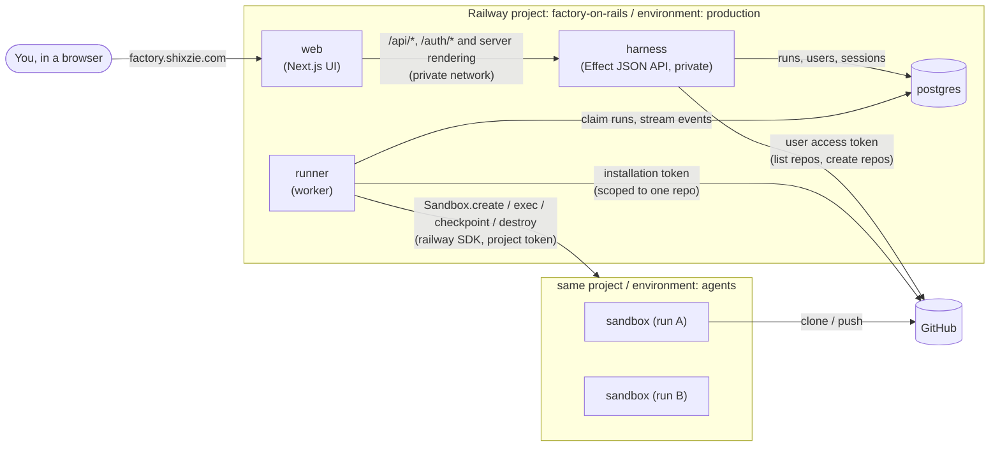

# Factory on Rails: architecture

Factory on Rails is a software factory that runs entirely on Railway. You sign in
with GitHub, pick a repository (or create one), describe a change, and a coding
agent does the work in a Railway sandbox and hands it back as a pull request.
A run is a conversation: send it another message and the agent carries on in
the same sandbox. This document describes the first foundation: what exists in this
repository, how the pieces fit, and what comes next.

## Components



| Piece | Where | What it does |
|---|---|---|
| `.railway/railway.ts` | Railway IaC | Declares the `web`, `harness` and `runner` services and the `postgres` database for the environment. |
| `apps/web` | Railway service, public | The UI: Next.js (App Router) with shadcn/ui, laid out like t3code. Forwards `/api/*` and `/auth/*` to the harness. |
| `apps/harness` | Railway service, private | JSON API and GitHub sign-in: repository list and creation, starting and cancelling runs, run logs, API keys. |
| `apps/runner` | Railway service, private | Claims queued runs, drives one Railway sandbox per run, pushes the branch and opens the PR. |
| `packages/core` | Library | Postgres schema and data access, GitHub App auth, token encryption. |
| Railway Sandboxes | `agents` environment | Isolated VMs the agent runs in. One per run, kept between its turns, stopped when idle and deleted with the run. |

Stack: TypeScript on Node 22, pnpm workspaces, [Effect](https://effect.website)
throughout, and Railway's own `railway` npm package for both IaC and sandboxes.
TypeScript was chosen because Railway's IaC (`railway/iac`) and Sandbox SDK are
TypeScript-first (Python and Go IaC are beta; the Sandbox SDK is TypeScript
only), so the whole platform is one language.

### Effect

All application code is written with Effect 3:

- **Services and layers.** Every dependency is a `Context.Tag` service with a
  `Live` layer: `Store` (data access), `TokenCipher` (encryption),
  `GitHubUserApi` and `GitHubAppApi` (GitHub), `Sandboxes` (Railway), plus
  `HarnessConfig` and `RunnerConfig`. Each app's `index.ts` wires the live
  layers; tests swap in stubs with `Layer.succeed`.
- **Config** comes from `Config` (secrets as `Config.redacted`), so a missing
  or malformed variable fails at startup with its name.
- **Errors are typed.** `GitHubError`, `SandboxError`, `DecryptError`,
  `StepFailed` and the harness's `Unauthorized`/`ReauthRequired`/`LoginRejected`
  are `Data.TaggedError`s handled with `catchTag`; unexpected defects are logged.
- **Postgres** goes through `@effect/sql` and `@effect/sql-pg` (`SqlClient`,
  `PgClient.listen`), and migrations run with `@effect/sql`'s `Migrator` from
  the plain `.sql` files in `packages/core/migrations`.
- **HTTP.** The harness is an `@effect/platform` `HttpRouter` served by
  `@effect/platform-node`; request bodies, query strings and path params are
  decoded with `Schema`, and responses are encoded with the schemas in
  `packages/core/src/api.ts`. GitHub calls use `HttpClient` with
  `Schema`-decoded responses.
- **The web app** decodes the same `@factory/core/api` schemas with an
  `@effect/platform` `HttpClient` (`apps/web/src/lib/api.ts`), both in server
  components and in the browser. React stays plain React.
- **Resources and cancellation.** A turn's sandbox is a scoped resource
  (`acquireRelease`): once it holds the checkout it is kept for the next turn,
  and before that it is destroyed however the turn ends. Cancelling a run, or
  stopping the runner, interrupts the fiber, which kills the command in the
  sandbox.
- **Tests** use `@effect/vitest`.

## The web app

`apps/web` is a Next.js App Router app with [shadcn/ui](https://ui.shadcn.com)
components (Base UI primitives, Tailwind v4), modelled on
[t3code](https://github.com/pingdotgg/t3code): a left sidebar of repositories
with their runs under them, each run shown as a thread (the task as your
message, the agent's work log under it, the pull request at the end), and a
composer pinned to the bottom for the next task. Light and dark follow the
system, with a switch in the user menu.

It is the only public service. The browser talks to one origin; `/api/*` and
`/auth/*` are route handlers that forward the request as-is (cookies, Origin,
body) to the harness over Railway's private network (`HARNESS_INTERNAL_URL`)
and hand back its answer, redirects and `Set-Cookie` included. That keeps the
session cookie first-party, the GitHub callback at
`https://factory.shixzie.com/auth/callback`, and the harness's Origin check
unchanged. Server components call the harness directly with the visitor's
cookie. The run page polls `/api/runs/:id/events` every two seconds while a run
is live (and every 15 seconds while a finished run's sandbox is up, to show
when it stops), and fetches `/api/runs/:id/diff` whenever the page says the
diff moved. Its composer continues the run, and the header says whether the
sandbox is running, stopped or deleted.

A run page reads like a t3code turn (see "Watching and talking to the agent"
below): the agent's messages as prose, the tool calls between them as one-line
entries that expand to their input and output (commands with their output,
edits as diffs, the agent's plan as a checklist), its questions as cards, and
a side panel with the run's flow map or its diff. While the run is live the
page follows the newest activity until you scroll up.

## Infrastructure as Code

Railway's current IaC is a TypeScript file at `.railway/railway.ts`, evaluated
by the Railway CLI (`railway config plan` / `railway config apply`). The older
Config as Code (`railway.json` / `railway.toml`) is deprecated and stops being
read on 2026-12-01, so this repo does not use it.

- One file manages the whole environment (single-repo layout, no `partial`
  export). Removing a resource from the file deletes it on the next apply.
- Secrets never appear in the file. Services reference environment shared
  variables with `ctx.shared.NAME`, which compiles to `${{shared.NAME}}`.
- All three services build from this repository with Railpack (`pnpm run build`,
  plus `next build` for the web app) and use watch patterns so a change to one
  app doesn't redeploy the others.
- The custom domain belongs to the web app (see setup.md step 5 for moving it,
  since IaC can't register custom domains). The harness listens on `::` so the
  web app reaches it at `harness.railway.internal:8080`.
- The harness runs database migrations as its pre-deploy command, so a failed
  migration stops the deploy instead of shipping a broken schema.
- `.github/workflows/railway-config.yml` uses `railwayapp/config@v1`: every PR
  that touches `.railway/` gets a plan comment, and merging applies exactly the
  reviewed plan. It skips itself until the `RAILWAY_TOKEN` secret exists.

Environments and generated `*.up.railway.app` domains are not managed by IaC
(Railway leaves generated domains out of the file by design), so those are
one-time manual steps in [setup.md](setup.md).

## Sandboxes

Railway Sandboxes are isolated Linux VMs created on demand and scoped to a
Railway environment. The runner uses the SDK (`import { Sandbox } from "railway"`):

1. `Sandbox.create({ environmentId, env, region, networkIsolation: "ISOLATED", idleTimeoutMinutes })`,
   or `Sandbox.create(checkpointName, …)` from the user's sandbox snapshot
   (see below) or, failing that, `SANDBOX_CHECKPOINT` when it is set.
   `SANDBOX_REGION` pins blank sandboxes to the factory's region (Railway's
   default is us-west2); one from a checkpoint boots where the checkpoint was
   captured, and asking for another region is an error.
   The runner then runs `true` until the exec gateway accepts commands: it can still
   refuse with "status: CREATING" (close code 1008) just after the API reports RUNNING.
2. `sandbox.exec(...)` to check the sandbox can reach GitHub, clone, run the
   agent, commit and push, with `onStdout` / `onStderr` streaming into
   `run_events`. Every command starts with `export HOME="${HOME:-/root}"`,
   because exec can start a shell without HOME and git needs it, and exports
   the current GitHub token as `GH_TOKEN` (see below).
3. `sandbox.files.write(...)` for the task text, commit message and token, so
   user input never has to be quoted into a shell command.
4. `sandbox.checkpoint(name)` then `sandbox.destroy()` to stop a sandbox that
   sat idle, and `Sandbox.create(name)` to boot it again (see below).

### Stopping and resuming a sandbox

Railway can't pause a sandbox: one is running until it is destroyed. So the
factory "stops" a sandbox by saving its disk as a checkpoint and destroying
the VM, and resumes it by booting a new sandbox from that checkpoint. Files
survive (the checkout, uncommitted work, the agent's session in `~/.claude`);
running processes don't, which is fine because nothing runs between turns.

```
new run ──▶ running ──(5 min idle)──▶ stopping ──▶ stopped
               ▲                                     │
               └──────────── next message ◀──────────┘
   (7 days without activity: the run, its events, diff and sandbox or checkpoint are deleted)
```

- **After a turn** the sandbox stays `running`, so a quick follow-up starts
  instantly. Every heartbeat, user message and turn bumps the run's
  `last_activity_at`.
- **Idle stop.** Every 30 seconds each runner claims finished runs whose
  sandbox has had no activity for `SANDBOX_IDLE_STOP_MINUTES` (5), marking
  them `stopping` so only one runner takes each. It deletes the token file,
  checkpoints the disk as `run-<run id>-<time>` and destroys the VM. A
  sandbox that can't be saved is destroyed anyway (billing stops either way)
  and the run notes that the next turn starts from the branch.
  `SANDBOX_IDLE_TIMEOUT_MINUTES` (Railway's own idle timeout, 15) stays as a
  backstop if no runner is around.
- **Resume.** The next message queues the run again. The runner connects to
  the sandbox if it is still running, or boots one from the checkpoint and
  then deletes the checkpoint. If neither works it creates a new sandbox and
  checks out the run's branch from GitHub, so pushed work is never lost.
- **Retention.** Runs with no activity for `RUN_RETENTION_DAYS` (7) are
  deleted, with their events, diff, and sandbox or checkpoint. The sandbox or
  checkpoint goes first, so a failure leaves the run to be tried again rather
  than leaking a checkpoint.
- **Checkpoint limit.** An environment holds as many checkpoints as its plan
  allows sandboxes (50 on Hobby, 100 on Pro), so that caps how many runs can
  be stopped at once. Past it, stopping falls back to destroying.
- **Tokens.** Installation tokens expire after an hour and a sandbox can live
  far longer, so the token is not baked into the sandbox env. Each turn writes
  a fresh one to `/workspace/.factory/gh-token` (mode 0600); every command
  exports it as `GH_TOKEN`, and git reads it through a credential helper, so it
  never lands in `.git/config` or a checkpoint.

### Sandbox snapshots

A snapshot is a sandbox someone prepared by hand (signed Codex or Claude Code
in to a subscription, installed toolchains) and saved as a named checkpoint in
the `agents` environment ([setup.md](setup.md), step 7). A user picks one under
Settings, and every new sandbox for their runs boots from it; a sandbox
resumed from a stopped run's checkpoint already has its contents.

- **Who may use one.** Railway checkpoints have no owner, and a snapshot can
  hold someone's sign-in, so users can't name a checkpoint themselves. The
  operator declares each snapshot and the GitHub logins allowed to use it in
  `SANDBOX_SNAPSHOTS` (`name=login|login`, `*` for everyone). The harness only
  offers and saves those (`GET`/`PUT /api/settings/snapshot`, stored in
  `users.sandbox_snapshot`), and the runner checks again when it picks a run
  up, failing it with a clear message if the snapshot was taken away. Names
  starting with `run-` are the runner's own and are never accepted.
- **Credentials.** An agent with a key saved in Settings gets that key, which
  takes precedence over a sign-in in the snapshot; with no key, it runs on the
  snapshot's sign-in, and a user with a snapshot can start runs without a key.

Decisions:

- **Separate `agents` environment.** Sandboxes live in their own environment
  and the runner holds a project token for that environment only
  (`RAILWAY_SANDBOX_TOKEN`). A compromised agent or runner cannot redeploy or
  reconfigure the production services, and sandbox caps (50 per environment on
  Hobby, 100 on Pro) don't compete with anything else.
- **`ISOLATED` networking.** Sandboxes get internet egress but no route to the
  factory's private network, so agents cannot reach Postgres.
- **Secrets out of `ps`.** The user's own model API key is passed as sandbox
  `env` when the sandbox is created, and the GitHub token is written to a file
  (see above), never per `exec`, which keeps them out of `ps` inside the VM.
  The runner also scrubs both values from stored run output.
- **Checkpoints for speed.** The standard image already has git, Node and
  common coding agents. A checkpoint with toolchains installed can be set as
  `SANDBOX_CHECKPOINT` so every run without a snapshot of its own boots from
  it; it is shared by everyone, so it holds no one's sign-in.

## The harness and the run lifecycle

A **run** is one conversation against one repository in one sandbox. Each
time the runner picks it up is a **turn**: the first does the task, and each
later one answers the messages the user sent since.

```
queued ──▶ running ──▶ succeeded | failed ──(user sends a message)──▶ queued
   │           │
   └─▶ cancelled ◀── cancelling
```

1. The harness validates that the chosen repository is reachable by this user
   through the chosen GitHub App installation, then inserts a `queued` run and
   sends `NOTIFY runs_queued`.
2. A runner replica claims it with `UPDATE … WHERE id = (SELECT … FOR UPDATE SKIP LOCKED)`,
   so any number of runner replicas can share the queue without double-claiming.
3. The runner mints an installation token scoped to that one repository
   (contents and pull requests write), creates the sandbox, clones the base
   branch, and checks out `factory/run-<id>`.
4. It runs the run's agent in the repo: `AGENT_SETUP_COMMAND` and
   `AGENT_COMMAND` for Claude Code, in headless mode
   (`claude -p … --output-format stream-json`), or `CODEX_SETUP_COMMAND` and
   `CODEX_COMMAND` for Codex (`codex exec --json`), each with the factory's
   ask-the-user tool and inbox hook (see "Agents" below). Any CLI that edits
   files in the working tree works as a command, and plain text output is
   shown as a log.
5. It commits whatever the agent left uncommitted, pushes the branch if it
   moved, and opens a pull request. The sandbox stays up for the next turn.
6. The runner heartbeats every 10 seconds. If a user cancels, the heartbeat
   sees `cancelling` and interrupts the run, which kills the agent process.
   When a runner is stopped (redeploy, scale down), it interrupts its runs
   the same way and marks them failed. If a runner dies without stopping
   cleanly, another replica's reaper fails its runs. Either way the sandbox
   is kept, so a message picks the run up again.
7. A message to a finished run (`POST /api/runs/:id/messages`) queues it
   again. On that turn the agent continues its Claude Code session
   (`claude --continue`, signalled by `FACTORY_CONTINUE`) with the new
   messages as its prompt; in a new sandbox it gets the original task and the
   messages instead. Commits go to the same branch and pull request; if that
   pull request was merged or closed, a new one is opened. A run that
   finishes while a message is still unread goes straight back to the queue.

### Run titles

Right after inserting a run, the harness names it in the background
(`apps/harness/src/titles.ts`): a small, fast model turns the task into a
title of a few words, which the sidebar and run header show. It uses the
user's own key, preferring the run's agent's provider: Claude Haiku 4.5
(`claude-haiku-4-5`) with an Anthropic API key, or GPT-6 Luna (`gpt-6-luna`)
with an OpenAI key. A Claude subscription token is not used, since it is for
Claude Code rather than direct API calls, so a user with only a token or a
snapshot gets no generated title and lists show the task's first line
instead. Generation has a 20 second limit and every failure is logged and
dropped, so it can never fail or slow the run. `PATCH /api/runs/:id` renames a
run; a name the user gave (`runs.title_by_user`) is never replaced.

Run output is stored in `run_events` (batched once a second, capped at 5 MB per
run) and the run page polls it.

## Agents

A run uses Claude Code or Codex, picked in the composer (`runs.agent`; the
new-run page starts on the agent used last). Both get the same tools and
show up the same way on the run page.

| | Claude Code | Codex |
|---|---|---|
| Command | `claude -p "<task>" --output-format stream-json` | `codex exec --json - < TASK.md` |
| Next turn | `--continue` | `codex exec resume --last` |
| Unattended | `--dangerously-skip-permissions` | `--dangerously-bypass-approvals-and-sandbox` (the Railway sandbox is the boundary) |
| ask_user server and hooks | `--mcp-config` and `--settings` files | `-c` overrides, one per line of `codex-config`, with `--dangerously-bypass-hook-trust` |
| Factory instructions | `--append-system-prompt` | `-c developer_instructions=…` |
| Output parser | `agent-stream.ts` | `codex-stream.ts` |
| Credentials | `CLAUDE_CODE_OAUTH_TOKEN` or `ANTHROPIC_API_KEY` | `CODEX_API_KEY` |

Codex prints `thread.started`, `turn.*` and `item.*` events. Each item maps
onto the Claude Code tool it stands for, so the run page, the subagent cards
and the flow map need nothing Codex-specific beyond one tool:
`command_execution` becomes `Bash`, `mcp_tool_call` becomes
`mcp__<server>__<tool>` (so `ask_user` shows as a question), `todo_list`
becomes `TodoWrite`, `web_search` becomes `WebSearch`, a `spawn_agent` call
becomes `Agent`, and `file_change`, which names the files a patch touched but
not its lines, becomes `FileChange` (the Diff panel has the lines). Its hooks
take the same JSON as Claude Code's, so the inbox hook serves both.

## Watching and talking to the agent

The runner turns the agent's stream into structured events and gives the
agent a way to reach the user, so a run can be followed and steered from the
run page while it works.

- **Activity.** The agent's JSON output (Claude Code's `stream-json`, or
  Codex's events, see "Agents" above) is parsed line by line
  (`apps/runner/src/agent-stream.ts`, `codex-stream.ts`) into `message`, `thinking`, `tool_call`
  (name and input), `tool_result` and `agent_result` events in `run_events`,
  with details in its `data` column. Lines that aren't agent JSON stay
  `stdout`, so other agent CLIs still get a log. Long tool inputs and outputs
  are capped at 16 KB each, and everything counts toward the 5 MB budget.
- **Subagents.** Events from a subagent carry `data.parentToolUseId`, the id
  of the Agent (formerly Task) call that started it. The default command adds
  `--forward-subagent-text` when the installed CLI supports it, so a
  subagent's prose and thinking arrive too, not only its tool calls. When a
  subagent finishes, its duration, token count and tool count go into the
  result's `data.stats`. The run page nests each subagent's work in a card of
  its own and draws the run as a flow map (`apps/web/src/lib/flow.ts`): you,
  the agent, each subagent, the workspace, the web and the pull request, with
  every event sent as a packet along the lane between two of them.
- **Files changed.** While the agent runs, the runner snapshots
  `git diff` of the branch against the commit it started from (committed and
  uncommitted work, new files included) a few seconds after each tool call,
  staging into a throwaway index so it never touches the agent's own. The
  latest patch (up to 1 MB, cut at a file boundary) replaces the previous one
  in `run_diffs`, and one last snapshot is taken when the agent exits.
- **Questions.** The sandbox gets a small MCP server (`ask_user`, see
  `apps/runner/src/agent-tools.ts`). When the agent calls it, the run shows
  "Needs input" in the sidebar and a question card (with the agent's
  suggested answers as buttons); the call waits up to 30 minutes for the
  user's reply, then tells the agent to carry on with its best judgment.
- **Messages.** Anything the user sends to a live run
  (`POST /api/runs/:id/messages`) is stored as a `user_message` event. The
  runner polls for new ones every two seconds and drops each into an inbox
  directory in the sandbox. The next `ask_user` call takes it as the answer;
  otherwise a Claude Code hook hands it to the agent after its current tool
  call, and a Stop hook keeps the agent going if a message arrives as it
  finishes. Each message is delivered exactly once.

All of this lives in `/workspace/.factory` in the sandbox, outside the
repository, so none of it ends up in the pull request.

## GitHub login and repository access

The factory uses a **GitHub App**, not a classic OAuth App, because one App
gives both identities the platform needs:

- **User access tokens** (the App's OAuth web flow) sign you in and act as you:
  listing the installations and repositories you can use, and creating new
  repositories under your account (`POST /user/repos`, which GitHub allows for
  App user tokens with the "Repository creation" or "Administration" write
  permission). Tokens expire after 8 hours and are refreshed with the refresh
  token. Both are stored encrypted with AES-256-GCM (`TOKEN_ENCRYPTION_KEY`).
- **Installation access tokens** act as the App, scoped per call to a single
  repository and to `contents` + `pull_requests`, and expire after an hour.
  Only these ever enter a sandbox, so an agent can touch the repository it was
  given and nothing else.

Access control is set by `ALLOWED_GITHUB_LOGINS`: production uses `*`, so any
GitHub account can sign in (each user brings their own model key); a
comma-separated list restricts it, and an empty value lets nobody in.
Sessions are random 256-bit tokens in an HttpOnly, SameSite=Lax cookie, stored
server-side as SHA-256 hashes, and every state-changing request must carry our
own `Origin`.

## First-run setup

A deployment gets its GitHub App and sandbox environment one of two ways,
resolved by `InstanceSettings` (`packages/core/src/instance.ts`):

- **Environment variables** (`GITHUB_APP_*`, `RAILWAY_SANDBOX_TOKEN`,
  `SANDBOX_ENVIRONMENT_ID`; see [setup.md](setup.md)). They always win.
  Production runs this way.
- **The setup page** (`/setup` in the web app, `apps/harness/src/setup.ts`),
  which is what the [Railway template](railway-template.md) relies on. It
  stores what it creates in `instance_settings`, secrets encrypted with
  `TOKEN_ENCRYPTION_KEY`, and the harness and runner read it per call, so
  nothing needs a redeploy.

The setup page has two steps:

1. **GitHub App from a manifest.** The harness builds the manifest (callback
   URL, permissions, webhooks off) and a state cookie; the browser posts it to
   GitHub, the person confirms, and GitHub redirects to
   `/auth/setup/github-app` with a code the harness converts into the App's id,
   slug, client secret and private key. Nobody can sign in yet, so this step
   is open to anyone: the harness only keeps an App whose owner is named in
   `ALLOWED_GITHUB_LOGINS`, so a stranger who finds a fresh deployment can't
   plant their own App in it. The first App stored wins.
2. **Sandbox environment.** A signed-in admin (named in
   `ALLOWED_GITHUB_LOGINS`, or the App's owner) pastes a Railway account or
   workspace token. The harness uses it once, through Railway's public API,
   to find or create the `agents` environment in its own project
   (`RAILWAY_PROJECT_ID`) and to mint a project token scoped to it, which is
   what gets stored. The pasted token is never stored or logged.

The runner reports at startup whether its own variables configure sandboxes,
so the harness (which can't see the runner's variables) knows a hand-configured
deployment is ready. Until sandboxes are ready the harness refuses new runs
with `setup_required` and the web app shows a banner linking to `/setup`.

## Bring your own key

There is no platform-wide model API key. Each user saves their own provider
key under **Settings**, and it is used for their runs only.

- Keys are validated for shape, encrypted with AES-256-GCM
  (`TOKEN_ENCRYPTION_KEY`) and stored in `user_api_keys`, one per user and
  provider. The UI only ever shows the last four characters.
- Providers: an Anthropic API key and a Claude subscription token (from
  `claude setup-token`, which bills the user's Pro, Max, Team or Enterprise
  plan) for Claude Code, and an OpenAI API key for Codex.
- The harness refuses to queue a run whose agent has no credential (unless
  the user picked a sandbox snapshot, which can carry the agent's sign-in)
  and sends them to Settings. The runner decrypts the one credential the
  run's agent should use when it picks the run up and injects it under its
  env var, so the agent CLI in the sandbox bills that user's account. Only
  one goes in: Claude Code prefers an API key over a subscription token, so
  a saved subscription token is passed alone.
- Providers and agents live in `packages/core/src/providers.ts`. Adding one
  is a new entry there with its env var and key check.
- The agent can read the key inside its sandbox, which is inherent to running
  an agent with the user's credentials. The sandbox is isolated from the
  platform's network, stopped after a few idle minutes and deleted with the
  run after a week without activity.

## Data model

`packages/core/migrations/001_init.sql`:

- `users`: GitHub identity plus encrypted user tokens.
- `sessions`: hashed session tokens with expiry.
- `runs`: the queue and the record of each run (status, branch, sandbox id, PR URL, error, heartbeat).
- `run_events`: append-only log per run: runner steps, command output, and the agent's messages, tool calls and results, plus messages from the user (`003_run_activity.sql`).
- `run_diffs`: the latest diff of each run's branch against its base commit.
- `runs` also tracks its sandbox between turns (`004_sandbox_lifecycle.sql`):
  `sandbox_state` (none, running, stopping, stopped, deleted), the checkpoint
  a stopped one boots from, `last_activity_at`, `turns`, and the last user
  message handed to the agent.
- `user_api_keys`: each user's encrypted model API keys (bring your own key).
- `runs.agent` and `users.sandbox_snapshot` (`005_agents_and_snapshots.sql`):
  the agent a run uses, and the snapshot a user's runs start from.
- `runs.title` and `runs.title_by_user` (`007_run_titles.sql`): the run's
  generated or user-given name.
- `instance_settings`: what the setup page created, one JSON value per key
  (`github_app`, `sandboxes`, and the runner's `runner` report), secrets
  encrypted (`006_instance_settings.sql`).

## What this foundation does not do yet

These are the natural next steps, roughly in order:

1. **Snapshots from the web app.** Let users prepare their own snapshot from
   Settings (a sandbox with a browser terminal, saved and owned by them)
   instead of an operator preparing it with the Railway CLI.
2. **Iterating on a PR.** Re-run against an existing branch with review
   comments as the task, and react to GitHub webhooks (PR comments, CI results).
3. **Pipelines.** Multi-step factories (plan, implement, test, review) with a
   sandbox per step and forks to try approaches in parallel.
4. **Secrets per repository.** Let a repository declare which extra variables
   its sandbox needs, encrypted per user alongside their API keys.
5. **Preview deploys.** Use sandbox public domains (`networkIsolation: "PRIVATE"`
   with `domains`) to expose a running app for review.
6. **Multi-user.** Organisations, per-repo permissions, and quotas instead of an allowlist.

## References

- Railway Infrastructure as Code: https://docs.railway.com/infrastructure-as-code
- Railway IaC reference: https://docs.railway.com/infrastructure-as-code/reference
- Railway Sandboxes: https://docs.railway.com/sandboxes
- Railway SDK: https://github.com/railwayapp/railway-ts-sdk
- Railway config GitHub Action: https://github.com/railwayapp/config
- GitHub App permissions per endpoint: https://docs.github.com/en/rest/authentication/permissions-required-for-github-apps
